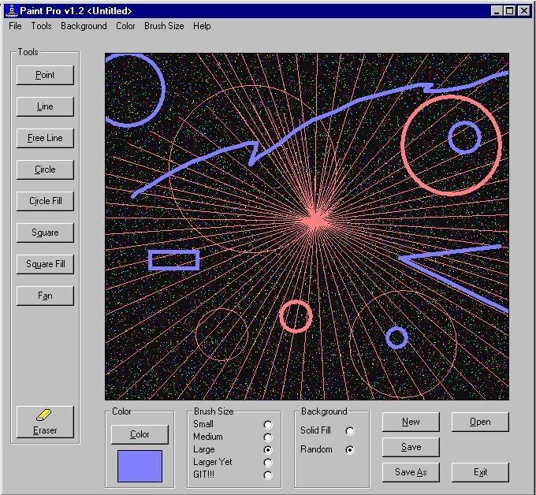



## Ace Paint

### Description

General use paint program. Debugged and enriched version of my previous post. Please take a look at it and provide some feedback. No API calls, pure VB. Trying to figure out how to add 'live draw' mode. If anyone knows, please share. Vote if you like this.
 
### More Info
 

             |
---                |---
**Submitted On**   |2002-09-11 16:12:26
**By**             |[Gene Shoykhet](https://github.com/Planet-Source-Code/PSCIndex/blob/master/ByAuthor/gene-shoykhet.md)
**Level**          |Beginner
**User Rating**    |5.0 (10 globes from 2 users)
**Compatibility**  |VB 4\.0 \(32\-bit\), VB 5\.0, VB 6\.0
**Category**       |[Graphics](https://github.com/Planet-Source-Code/PSCIndex/blob/master/ByCategory/graphics__1-46.md)
**World**          |[Visual Basic](https://github.com/Planet-Source-Code/PSCIndex/blob/master/ByWorld/visual-basic.md)
**Archive File**   |[Ace\_Paint1307629132002\.zip](https://github.com/Planet-Source-Code/gene-shoykhet-ace-paint__1-38965/archive/master.zip)

